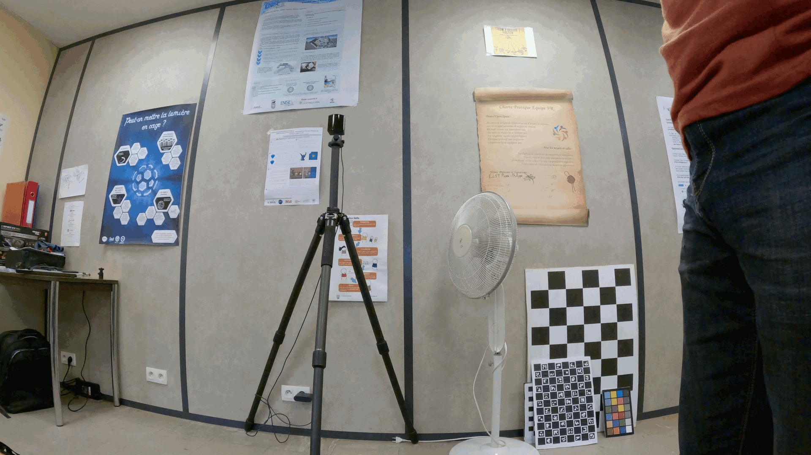

# Camera Calibration Toolbox

This is a simple camera calibration toolbox for calibrating cameras with a ChArUco chessboard pattern. It uses OpenCV for the calibration process.



# Installation

## Using Conda (recommended)

```bash
conda create -n camera_calibration python=3.10
conda activate camera_calibration
pip install -r requirements.txt
```